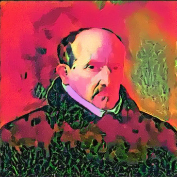

## Trying Universal Style Transfer 

i was thinking can i impliment cycle gan, maybe later i'll try it for fun
and with the current method in this [paper](https://arxiv.org/pdf/1705.08086.pdf) 
 

here is an example of how this thing works  

the size is [512, 512] because i was out of vram so i had to do this on my i5 10gen [SAD]

---
i think i can make a webapp for style transfer with transfering style with respect to 
the artist of choice like 

Albrecht Dürer  
Alfred Sisley 
Amedeo Modigliani 
Andrei Rublev 
Andy Warhol 
Camille Pissarro 
Caravaggio 
Claude Monet 
Diego Rivera 
Diego Velazquez 
Edgar Degas 
Edouard Manet 
Edvard Munch 
El Greco 
Eugene Delacroix 
Francisco Goya 
Frida Kahlo 
Georges Seurat 

and more ...
